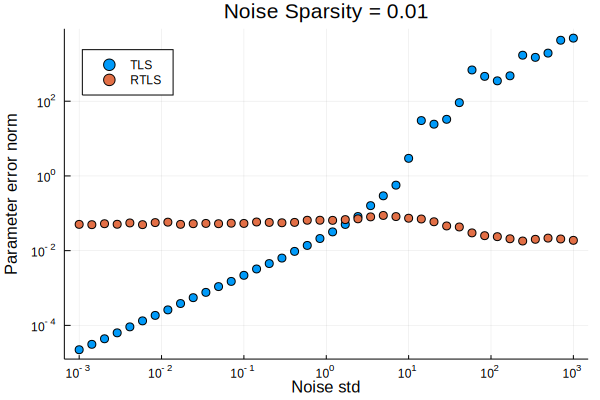

[](https://travis-ci.org/baggepinnen/TotalLeastSquares.jl)
[](https://juliaci.github.io/NanosoldierReports/pkgeval_badges/report.html)
[](https://codecov.io/gh/baggepinnen/TotalLeastSquares.jl)


# TotalLeastSquares.jl

Solve (weighted) total least-squares problems

These functions are exported:

- `x = tls(A,y)`
  Solves the standard TLS problem using the SVD method. An inplace version `tls!(Ay, n)` also exists, for this you need to supply `Ay = [A y]` and the width of `A`, `n = size(A,2)`.
- `x = wtls(A,y,Qaa,Qay,Qyy,iters=10)`
  Solves the weighted TLS problem using algorithm 1 from (Fang, 2013)
  The Q-matrices are the covariance matrices of the noise terms in `vec(A)` and `y` respectively.
- `Qaa,Qay,Qyy = rowcovariance(rowQ::AbstractVector{<:AbstractMatrix})`
  Takes row-wise covariance matrices `QAy[i]` and returns the full (sparse) covariance matrices. `rowQ = [cov([A[i,:] y[i]]) for i = 1:length(y)]`
- `x = wls(A,y,Qyy)` Solves the weighted standard LS problem. `Qyy` is the covariance matrix of the residuals with side length equal to the length of `y`.
- `x = rtls(A,y)` Solves a robust TLS problem. Both `A` and `y` are assumed to be corrupted with high magnitude, but sparse, noise. See analysis below.
- `Â, Ê, s, sv = rpca(D; kwargs...)` robust matrix recovery using robust PCA. Solves `minimize_{A,E} ||A||_* + λ||E||₁ s.t. D = A+E`

## Example
```julia
using TotalLeastSquares, FillArrays, Random, Printf
Random.seed!(0)
x   = randn(3)
A   = randn(50,3)
σa  = 1
σy  = 0.01
An  = A + σa*randn(size(A))
y   = A*x
yn  = y + σy*randn(size(y))
Qaa = σa^2*Eye(prod(size(A)))
Qay = 0Eye(prod(size(A)),length(y))
Qyy = σy^2*Eye(prod(size(y)))


x̂ = An\yn
@printf "Least squares error: %25.3e %10.3e %10.3e, Norm: %10.3e\n" (x-x̂)... norm(x-x̂)

x̂ = wls(An,yn,Qyy)
@printf "Weigthed Least squares error: %16.3e %10.3e %10.3e, Norm: %10.3e\n" (x-x̂)... norm(x-x̂)

x̂ = tls(An,yn)
@printf "Total Least squares error: %19.3e %10.3e %10.3e, Norm: %10.3e\n" (x-x̂)... norm(x-x̂)

x̂ = wtls(An,yn,Qaa,Qay,Qyy,iters=10)
@printf "Weighted Total Least squares error: %10.3e %10.3e %10.3e, Norm: %10.3e\n" (x-x̂)... norm(x-x̂)
println("----------------------------")
```
```julia
Least squares error:                 3.753e-01  2.530e-01 -3.637e-01, Norm:  5.806e-01
Weigthed Least squares error:        3.753e-01  2.530e-01 -3.637e-01, Norm:  5.806e-01
Total Least squares error:           2.897e-01  1.062e-01 -2.976e-01, Norm:  4.287e-01
Weighted Total Least squares error:  1.213e-01 -1.933e-01 -9.527e-02, Norm:  2.473e-01
----------------------------
```

## Robust TLS analysis
The code for this analysis is [here](https://github.com/baggepinnen/TotalLeastSquares.jl/blob/master/total_vs_robust_demo.jl).

We generate random data on the form `Ax=y` where both `A` and `y` are corrupted with sparse noise, the entries in `A` are Gaussian random variables with unit variance and `size(A) = (500,5)`. The plots below show the norm of the error in the estimated `x` as functions of the noise variance and the noise sparsity.




The results indicate that the robust method is to be preferred when the noise is large but sparse.

# Notes
This package was developed for the thesis  
[Bagge Carlson, F.](https://www.control.lth.se/staff/fredrik-bagge-carlson/), ["Machine Learning and System Identification for Estimation in Physical Systems"](https://lup.lub.lu.se/search/publication/ffb8dc85-ce12-4f75-8f2b-0881e492f6c0) (PhD Thesis 2018).
```bibtex
@thesis{bagge2018,
  title        = {Machine Learning and System Identification for Estimation in Physical Systems},
  author       = {Bagge Carlson, Fredrik},
  keyword      = {Machine Learning,System Identification,Robotics,Spectral estimation,Calibration,State estimation},
  month        = {12},
  type         = {PhD Thesis},
  number       = {TFRT-1122},
  institution  = {Dept. Automatic Control, Lund University, Sweden},
  year         = {2018},
  url          = {https://lup.lub.lu.se/search/publication/ffb8dc85-ce12-4f75-8f2b-0881e492f6c0},
}
```
